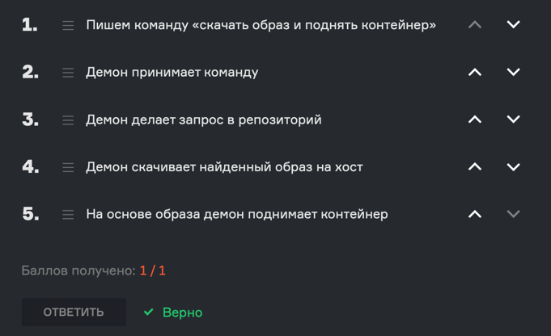
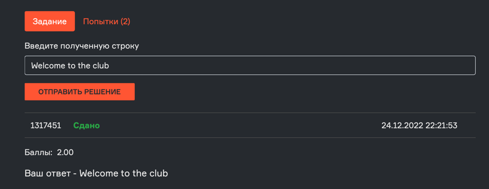

# 1 Урок
## ЗНАКОМСТВО С DOCKER

1. Лекция\
    1.0 [Интро](https://youtu.be/7tyaWfSuQzc?si=w2n5qgnSjKcA2SBd)\
    1.1 [Что такое докер](https://youtu.be/3wGSxznrvU4?si=tj8yDsN1vR1PSeE6)\
    1.2 [Сущности докера](https://youtu.be/kfJfSVRkYro?si=rGwsY4fou65PCmMn)
2. [Задания](#tasks)\
    2.1 [Задание 1](#-task-1)\
    2.2 [Задание 2](#-task-2)\
    2.3 [Задание 3](#-task-3)\
    2.4 [Задание 4](#-task-4)\
    2.5 [Задание 5](#-task-5)\
    2.6 [Задание 6](#-task-6)\
    2.7 [Задание 7](#-task-7)\
    2.8 [Задание 8](#-task-8)\
    2.9 [Задание 9](#-task-9)

---
## Tasks
### \> Task 1
Вы получили следующее сообщение:


Какое свойство описывает этот пример лучше всего?
* Стандартизация
* Воспроизводимость
* Масштабирование

#### <font color="#dd7515">Мой ответ:</font>

Стандартизация -  <font color="#1ec76b">Верно</font>


### \> Task 2
Переписка продолжается. Сообщение от знакомого:

.svg)

Какое свойство описывает этот пример лучше всего?
* Воспроизводимость
* Масштабирование
* Стандартизация

#### <font color="#dd7515">Мой ответ:</font>

Воспроизводимость -  <font color="#1ec76b">Верно</font>


### \> Task 3
Ваш знакомый стал очень умелым разработчиком, именно поэтому вы не ожидали увидеть это сообщение:

.svg)

Какое свойство описывает этот пример лучше всего?
* Стандартизация
* Масштабирование
* Воспроизводимость

#### <font color="#dd7515">Мой ответ:</font>

Масштабирование -  <font color="#1ec76b">Верно</font>


### \> Task 4
Для чего вы можете использовать докер?

1. [x] Удобно развернуть несколько разных приложений
2. [x] Получить воспроизводимое окружение
3. [x] Удобно развернуть несколько одинаковых приложений
4. [x] Упаковать программу вместе с её зависимостями и доставить на сервер
5. [x] Развернуть на удаленном сервере бекенд, написанный как на Django, так и на Flask


### \> Task 5
Соотнесите сущности докера

| Docker container (Контейнер)  | --> | Изолированная среда запуска приложений                |
|-------------------------------|-----|-------------------------------------------------------|
| Docker host (Хост)            | --> | Компьютер, на котором установлен докер                |
| Docker daemon (Демон)         | --> | Фоновая программа, которая управляет объектами докера |
| Docker image (Образ)          | --> | Шаблон инструкций по созданию докер контейнера        |
| Docker client (Клиент)        | --> | Интерфейс взаимодействия с демоном                    |
| Docker registry (Репозиторий) | --> | Сервер, используемый для хранения образов             |


### \> Task 6
`Где могут храниться образы?`
1. [x] Docker Hub
2. [x] Собственный, поднятый на сервере, репозиторий
3. [x] GitLab Container Registry
4. [x] Container Registry от Google Cloud
5. [x] Container Registry от GitHub
6. [x] Amazon ECR
7. [x] Yandex Container Registry
8. [x] DigitalOcean Container Registry


### \> Task 7
Перед вами результат вывода команды htop.


* В контейнере python
* В контейнере node
* В контейнере nginx
* На хосте
* Это очевидный фотошоп


#### <font color="#dd7515">Мой ответ:</font>
На хосте -  <font color="#1ec76b">Верно</font>


### \> Task 8
 Вы установили себе докер и хотите поднять контейнер. Вот только у вас пока нет никаких образов :(

Расположите алгоритм того, что сделает докер, когда вы напишете команду «Поднять контейнер».
Наверху — первое действие.




### \> Task 9
Между прочим, а вы установили Docker? 👀 Давайте на всякий случай убедимся.

Вам нужно выполнить следующие команды:

1. `docker pull kcoursedocker/task-1.1`
2. `docker run --rm kcoursedocker/task-1.1`

```dockerfile
# Команда №1
docker pull kcoursedocker/task-1.1

# Команда №2
docker run --rm kcoursedocker/task-1.1
```
Введите полученное предложение в окошко для ответа.

P.S. На сами команды пока не обращайте внимание.


